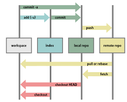
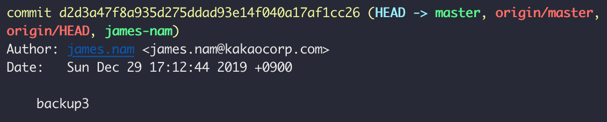

# git-cheatsheet

## 처음 git에게 버전 관리 신청
- git init: 현재 위치의 파일을 git이 관리할 수 있게 초기화

## 기본 구조

working tree – staging area – repository

- working tree: 파일을 만들고 수정하면서 버전 저장을 하지 않은 공간
- staging area: 수정한 파일 중 자신이 원하는 파일을 버전으로 묶어서 올리는 공간
- repository: 올린 버전을 실제로 저장하는 곳

## add & commit(파일 올리기)
- git status : working tree의 상태 알려줌
- git add [file] : 파일을 working tree에서 staging area로 보내줌

- git add . : 현재 디렉토리 내 파일 중 new 또는 modified 된 것만 staging area로 보내줌
- git add -a : 현재 디렉토리 내 모든 파일들을 staging area로 보내줌
- git add * : 숨겨진 파일(.으로 시작하는 파일)을 제외한 모든 파일을 보내기 
- git add -u : modified 또는 deleted된 파일을 staging area로 보내줌

- git commit: 기본 설정 에디터에 연결, message 작성 및 commit
- git commit -m [“message”] : staging area에서 repository로 올리기, 이때 메세지를 통해 수정 정보를 간단히 적을 수 있음
- git commit -am [“message”] : add 및 commit 동시 진행, 이때 add된 파일들은 적어도 한번은 add 및 commit이 된 전적이 있어야(tracked 되어야) 한다.

## git 히스토리 탐색
- git log: 깃의 역사를 살펴보기
- git log --stat : 실제 연루된 파일을 역사에 모두 보여줌
- git log -p: 과거에 어떠한 변경이 있었는지 보여줌 
- git log –all –graph –oneline : 한 줄로 그래프를 보여주며 전체의 히스토리를 보여줌
 
## git log 내용

- d2d3a47...... : version id
- () 내부: 현재 version을 가리키는 branch 이름들, 현재 HEAD는 master branch를 가리킴
- Author, date: 이름 및 commit 시간
- backup3: 메세지

## 이전 버전과 다른 점 확인
- git diff: 업데이트된 버전의 다른 코드 부분 살피기

## 이전 버전으로 돌리기
- git reset --hard [version id] : 그 이후의 버전을 모두 삭제, 히스토리까지 다 삭제
- git revert [version id] : 기존의 commit 내버려둔 채 과거의 버전으로 변경

## 올리면 안되는 파일 commit시 삭제 방법
- git rm --cached [파일 이름]: commit 이미 진행된 파일 git에서 빼내기
- git filter-branch --tree-filter "rm -rf [디렉토리 이름]" HEAD: history에 있어선 안되는 정보 있는 파일 삭제
-> git push origin --force –all로 github에 업데이트

## branch 설정 & merge
- git branch: 현재 파일의 branch 목록을 보여줌
- git branch [branch이름] : 이름에 맞는 branch 생성
- git branch -d [branch이름] : 이름에 맞는 branch 삭제
- git checkout [branch이름] : 이름에 맞는 branch로 이동
- git merge [branch이름] : 현재 head가 가리키는 branch에 해당 이름의 branch를 병합

## mergetool
- git mergetool: 미리 설정한 merge tool을 이용해 conflict 관리
- 대표 툴 중 하나인 p4merge 세팅 방법: https://gist.github.com/tony4d/3454372

## 원격 저장소 연결
- git remote add [원격저장소 이름] [원격 저장소 url주소] : 로컬 저장소와 원격 저장소 연결, 원격 저장소 이름 부여(기본적으로 원격 저장소 이름에 origin 많이 사용)
- git remote: 원격 저장소 보여줌
- git remote -v: 원격 저장소 + 주소를 보여줌

## push & pull & clone
- git push -u [원격저장소 이름] [branch 이름] : 저장한 버전을 언급된 원격 저장소의 branch에 올리기, -u는 --set-upstream의 약자, 이를 입력 후 git pull시 추가 정보를 입력할 필요가 사라짐.
- git clone [원격저장소 주소] (원하는 이름): 원격 저장소에 있는 내용들을 그대로 다른 로컬 저장소에 붙여서 넣기. 원하는 이름으로 바꾸고 싶을 시 주소 다음에 원하는 이름 적어두기(꼭 할 필요는 없음)
- git pull: 하나의 원격 저장소에서 여러 로컬저장소가 연결되어 있을 시, 다른 로컬저장소가 push를 통해 변경했을 시 그 변경 내용을 자신의 로컬저장소에 적용하는 명령어

## fork
- git에선 명령어 존재 X, github에서 다른 사람의 원격저장소를 자신의 원격저장소로 복제해서 생성, github의 우측 상단 fork 버튼 누르는 것으로 가능
  * clone과 비슷하나 clone은 하나의 원격 저장소를 공유, fork는 아예 원격저장소를 복제해서 자신의 원격저장소로 가져오며 이는 완전 별개의 저장소
- 삭제: setting -> danger zone -> delete this repository 버튼 입력

## git config
- git의 여러 설정들을 저장, ~/.gitconfig에서 설정 확인 및 수정 가능

### 처음 등록 시 이름과 이메일 세팅
- git config --global user.name “my_name”
- git config --global user.email “my@email”

### 기본 에디터 설정(vim으로 설정 시)
- git config --global core.editor vim

### git alias 설정 통한 축약어 생성
- git alias를 지정해서 복잡한 형식의 명령어들을 간단히 만드는 것이 가능

### 여러 유용한 축약어
- git config --global alias.co checkout: checkout을 co로
- git config --global alias.ci commit: commit를 ci로
- git config --global alias.st status: status를 st로
- git config --global alias.br branch: branch를 br로
- git config --global alias.lg "log --color --graph --pretty=format:'%Cred%h%Creset -%C(yellow)%d%Creset %s %Cgreen(%cr) %C(bold blue)<%an>%Creset' --abbrev-commit --": git의 히스토리를 훨씬 예쁘고 한눈에 볼 수 있게 설정

## 그 외
- .gitingore: 버전 관리를 하면 안되는 파일의 이름을 적는 파일
- README.md: 설명글을 적는 파일
- [명령어] --help: 해당 명령어에 대한 설명을 보여줌
